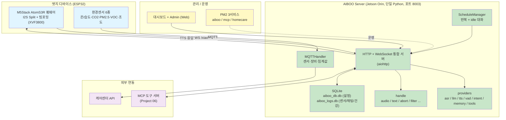
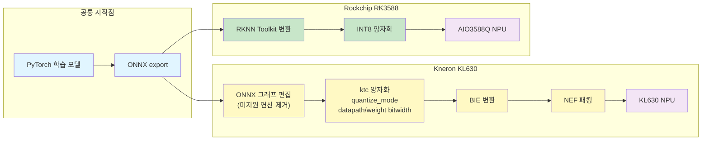
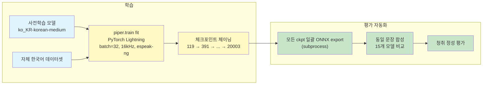
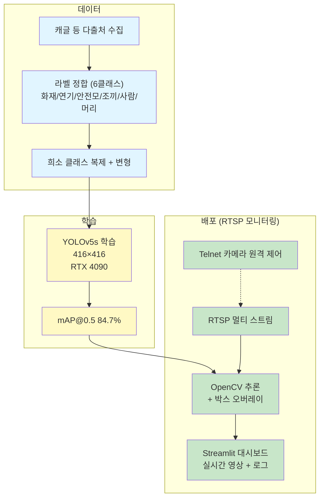
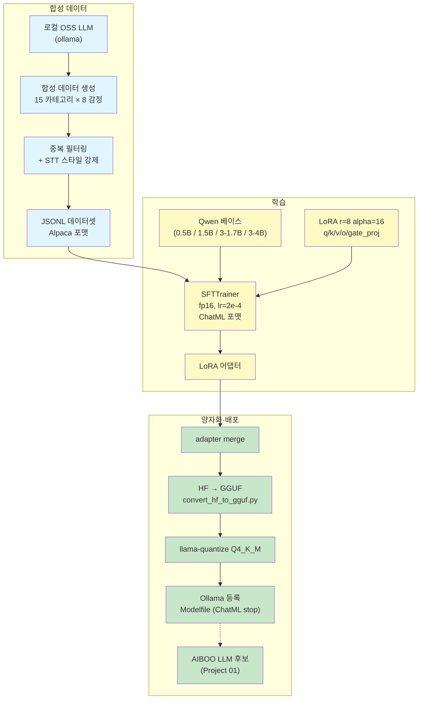
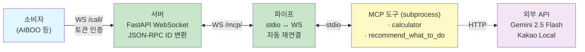

# 박진형 | AI Engineer

> AI 모델 학습/최적화부터 엣지 디바이스 배포까지, 온프레미스 AI 솔루션을 만듭니다.

**Contact:** tommyjin2894@gmail.com · [github.com/tommyjin2894](https://github.com/tommyjin2894)
**Status:** 이직 준비 중

---

## TL;DR

- **공공기관(보훈부) 노인 케어 AI 음성 비서** 단독 개발 중 — 납품 직전 (2026.04 말)
- **다중 NPU 모델 포팅 경험** — Kneron KL630, Rockchip RK3588
- **LLM 파인튜닝 풀 파이프라인** — 합성 데이터 생성 → LoRA → GGUF → Ollama 서빙
- **오픈소스 분석 + 도메인 적합화** — xiaozhi-esp32-server fork → 단일 Python 리팩토링

---

## Tech Stack

| 영역 | 기술 |
|------|------|
| **AI / ML** | PyTorch · YOLOv5/v8 · Hugging Face · Qwen · LoRA · llama.cpp · GGUF · Ollama · Faster-Whisper · CTranslate2 · Silero-VAD · Piper TTS |
| **Backend** | Python · FastAPI · aiohttp · Docker · WebSocket · MQTT · SQLite · Nginx · PM2 · OpenCV · Streamlit · FastMCP |
| **Edge AI** | NVIDIA Jetson (Orin/Nano) · Kneron KL630 · Rockchip RK3588 (RKNN) · CUDA · ONNX · onnx-graphsurgeon · ESP32 / ESP-IDF |

---

## Projects

### 01. AIBOO — Edge AI 음성 비서 (Jetson Orin)

> 공공기관(보훈부) 노인 케어 사업을 위한 Jetson Orin 기반 음성 비서.
> xiaozhi-esp32-server 계열 오픈소스를 단일 Python 서버로 리팩토링하고,
> 센서/건강/스케줄/긴급/정서지원 도메인 기능을 추가하여 production 시스템으로 구축.

| 기간 | 상태 | 개발 | 카테고리 |
|------|------|------|----------|
| 2025.02 ~ 현재 | 공공기관(보훈부) 납품 직전 (2026.04 말) | **단독** | Edge AI · Voice |

**Stack:** Jetson Orin · aiohttp · Faster-Whisper · CTranslate2 · Qwen / Gemini · Silero-VAD · MQTT · PM2 · ESP-IDF

**핵심 기여**
- **단일 Python 통합 리팩토링** — Docker 4컨테이너 → PM2 3서비스 (`aiboo`/`mcp`/`homecare`), 메모리 ~750MB 절감 (`btop`/`htop`/`nvidia-smi` 기준)
- **Jetson Orin 환경 구축** — PyTorch 2.9.1 + CTranslate2 cuBLAS 충돌 해결, CTranslate2 CUDA 소스 빌드, onnxruntime-gpu Jetson 빌드
- **HTTP + WebSocket 통합 서버** (단일 포트 8003) — 대시보드/Admin/OTA/비전 분석/`/xiaozhi/v1/` WS 모두 처리
- **도메인 기능 자체 구현** — 센서 모니터링 6종(MQTT 임계값 경보), 건강관리(sentiment+달력), 스케줄(daily/weekly/weekdays), 긴급감지(키워드+낙상), 정서지원(idle 대화/음악), i18n 84키
- **VAD/ASR 튜너 페이지** — 환경별 임계값 휴리스틱 튜닝 + DB 저장
- **SQLite WAL 모드 동시성 처리** — 비동기 컴포넌트(스케줄/MQTT/WS) 동시 쓰기 락 충돌 회피
- **Barge-in 구현** — LLM streaming cancel 대신 TTS 재생을 잘라내는 방식 (구현 단순성 + 자연스러운 흐름)
- **ESP32 펌웨어 튜닝** — 빔포밍 (XVF3800 I2C 제어), I2S Split (RX Slave + TX Master)



<details>
<summary><b>상세 — 환경, 기술적 판단, 한계</b></summary>

#### 환경 (Jetson Orin)
- JetPack 6 (R36.4), CUDA 12.6, Python 3.10
- PyTorch 2.9.1 — Jetson 전용 wheel (2.11+ 사용 시 CTranslate2 cuBLAS 충돌)
- CTranslate2 4.7.1 — CUDA 소스 빌드 필수 (PyPI 기본 패키지 CUDA 미지원)
- onnxruntime-gpu 1.19.0 — NVIDIA Jetson 전용 빌드

#### 베이스 vs 본인 작업
- **베이스:** xiaozhi-esp32-server 계열 fork (`m5chatbot-server` — Docker 4컨테이너 구성)
- **본인 작업 (`aiboo-server-lite`):** 단일 Python 통합, Jetson 환경, 도메인 8종 기능, ESP32 펌웨어 튜닝
- **브랜치 분리:** `main`(코어) / `bobo`(공공기관 도메인 특화 hooks)

#### 기술적 판단

**Docker 4컨테이너 → 단일 Python**
- Jetson 환경에선 컨테이너 오버헤드 + GPU 리소스 분할이 비효율
- 단일 프로세스 통합 + PM2 3서비스로 장애 격리는 유지

**Barge-in: TTS cut 전략**
- LLM 토큰 스트리밍 중단 대신 TTS 재생만 cut
- LLM streaming cancel은 model state 관리 복잡도가 높아 회피
- 결과: 자연스러운 대화 흐름 + 구현 단순성

**마이크 echo 처리**
- VAD threshold 동적 조정으로 TTS 출력 시 self-trigger 회피
- AEC 미적용 — 단일 디바이스 환경에서 임계값 튜닝으로 충분

**응답 지연**
- 발화 종료(VAD silence) → STT 결과 반환 ~1.5초 (Faster-Whisper FP16)
- LLM TTFT는 provider별 상이 (Gemini 클라우드 / 로컬 Qwen)

#### ESP32 펌웨어
- 베이스: 오픈소스 m5chatbot-build (ESP-IDF) 활용
- 본인이 환경/도메인에 맞게 튜닝 (빔포밍, I2S)
- 펌웨어 배포는 USB/시리얼 직접 업로드 (ESP32 측 OTA 미사용)
- 서버 측 OTA endpoint(`/xiaozhi/ota/`)는 Jetson 펌웨어/설정 배포용

#### 한계
- LLM TTFT, 종단 지연 정밀 측정 미실시 (production 안정화 우선)
- 다중 디바이스 동시 호출 시 자원 경합 미검증

</details>

---

### 02. Multi-NPU 모델 포팅 (Kneron KL630 + Rockchip RK3588)

> 서로 다른 NPU 아키텍처에 객체 탐지 모델을 포팅하기 위한 양자화 및 그래프 변환 파이프라인 작업.

| 기간 | 카테고리 | 연계 |
|------|----------|------|
| 2025.02 ~ 2025.09 | Edge AI | Fire/PPE Detection (모델 학습 측, Project 04) |

**Stack:** Kneron Toolchain (ktc) · RKNN Toolkit · ONNX · onnx-graphsurgeon · Docker

**핵심 기여**
- **Kneron KL630 변환 파이프라인** — ONNX → BIE → NEF, ktc 양자화 파라미터 튜닝 (`quantize_mode`, `datapath_bitwidth_mode`, `weight_bitwidth_mode` 등 비트폭 혼합)
- **ONNX 그래프 편집** — 미지원 연산(NMS 등 후처리)은 ONNX 그래프에서 노드 제거 → 호스트 측 C 애플리케이션에서 재구현하여 정확도 유지
- **출력 레이어 정확도 보존** — softmax/logits 영역은 int16 또는 post_sigmoid 모드 적용
- **Rockchip RK3588 변환** — RKNN Toolkit으로 YOLO-World 포팅, INT8 양자화
- **Docker 기반 KL630 크로스 컴파일 환경** — 재현성 확보



<details>
<summary><b>상세 — Kneron Toolchain 파라미터, 학습 포인트, 한계</b></summary>

#### Kneron Toolchain (ktc) 주요 파라미터
- `quantize_mode`: `default` / `post_sigmoid` — 출력 활성화 위치에 따라
- `datapath_bitwidth_mode`: `int8` / `int16` / `mix balance` / `mix light`
- `weight_bitwidth_mode`: `int8` / `int16` / `int4` / `mix balance` / `mix light`
- `model_in_bitwidth_mode` / `model_out_bitwidth_mode` — 입출력 비트폭 (KL520 계열은 int8 only)
- `cpu_node_bitwidth_mode` — CPU fallback 노드용
- `compiler_tiling`: `default` / `deep_search`
- `optimize`: 0~4 단계

#### 학습 포인트
- 다양한 NPU 환경 경험 (Kneron BIE/NEF, Rockchip RKNN)
- 양자화 비트폭 혼합 (mix int8 / int16) 전략 — 정확도 vs 추론 속도/메모리 트레이드오프
- ONNX 중간 포맷의 역할과 한계 — NPU 미지원 연산 처리 방법론
- 그래프 편집 vs 후처리 분리 판단

#### 한계
- 양자화 전후 mAP 손실 정량 비교 데이터 미보존
- KL630 calibration dataset 구성에 대한 체계적 비교 미실시

</details>

---

### 03. Piper TTS 한국어 Fine-tuning 실험

> 사전학습 Piper TTS 한국어 medium 모델에 자체 데이터셋으로 추가 학습하여 음질을 개선하는 실험 프로젝트.
> 학습 자동화 + 다중 체크포인트 정성 비교 평가.

| 기간 | 상태 | 카테고리 |
|------|------|----------|
| 2025.11 부근 | 실험 종료 (production 배포 전) | Voice AI |

**Stack:** PyTorch Lightning · espeak-ng · ONNX · subprocess 일괄 처리

**핵심 기여**
- **사전학습 모델 fine-tuning** — `ko_KR-korean-medium` 베이스에 자체 데이터로 추가 학습
- **장기 학습 재개 자동화** — `--ckpt_path` 체이닝 (epoch 119 → 391 → 7616 → 17410 → 20003)
- **평가 자동화** — 모든 ckpt 일괄 ONNX export → 동일 문장 합성 → 청취 비교 (15개 체크포인트)



<details>
<summary><b>상세 — 평가 코드 샘플, 한계</b></summary>

#### 평가 자동화 코드
```python
# 모든 .ckpt 일괄 ONNX 변환
for ckpt in glob("lightning_logs/version_2/checkpoints/*.ckpt"):
    subprocess.run(["python3", "-m", "piper.train.export_onnx",
                    "--checkpoint", ckpt, "--output-file", onnx_out])

# 동일 문장으로 모든 ONNX 모델 음성 합성
for model in glob("voices/*.onnx"):
    voice = PiperVoice.load(model)
    voice.synthesize_wav(test_text, wav_file)
```
테스트 문장: "현재 훈련을 진행중입니다. 점점 성능이 좋아지는게 느껴집니다."

#### 한계 및 회고
- MOS, RTF 등 정량 평가 미실시 (시간 제약)
- 한국어 전용 phonemizer 검토 미완 (espeak-ng `en-us` voice 사용)
- 데이터셋 규모/품질 통제 변수 부족 — 동일 문장 합성 청취만으로 비교

</details>

---

### 04. Fire/PPE 6클래스 객체 탐지 + RTSP 모니터링

> 산업 현장 안전을 위한 YOLOv5s 6클래스 객체 탐지 모델 학습 + RTSP 카메라 연동 실시간 모니터링.

| 기간 | 카테고리 | 연계 |
|------|----------|------|
| 2025.02 ~ 2025.09 | Model Training · Vision | Multi-NPU 포팅 (Kneron KL630 배포 측, Project 02) |

**Stack:** YOLOv5 · PyTorch · CUDA · OpenCV · Albumentations · Streamlit · TensorBoard · W&B

**핵심 기여**
- **6클래스 직접 학습** — 화재, 연기, 안전모, 안전조끼, 사람, 머리
- **다출처 데이터셋 통합** — 캐글 등에서 수집, 출처별 라벨 정의 차이를 통일된 6클래스로 매핑
- **클래스 불균형 처리** — 희소 클래스 데이터 복제 + 변형 (단순 복제로 충분한 효과 확인)
- **mAP@0.5 84.7% 달성** (YOLOv5 학습 출력 기준, RTX 4090)
- **RTSP 멀티 스트림 연동** — OpenCV 추론 + Streamlit 대시보드 실시간 영상/로그 시각화
- **Telnet 카메라 원격 제어**



<details>
<summary><b>상세 — 한계, 회고</b></summary>

- 클래스 불균형에 focal loss / weighted sampler 등 표준 기법 비교 실험은 미실시
- 학습 모델의 NPU(Kneron KL630) 배포 측면은 Multi-NPU 포팅(Project 02) 참조

</details>

---

### 05. Qwen LoRA 파인튜닝 + 합성 데이터 파이프라인

> AIBOO 음성 비서(보훈부 노인 케어)의 LLM 모듈로 활용하기 위해 Qwen 시리즈를 LoRA로 도메인 특화 파인튜닝.
> 외부 API에 의존하지 않는 자체 합성 데이터 생성 파이프라인까지 구축.

| 기간 | 카테고리 | 연계 |
|------|----------|------|
| 2025.12 ~ 현재 | LLM | AIBOO (Project 01) |

**Stack:** Qwen · LoRA · TRL (SFTTrainer) · ollama · llama.cpp · GGUF · Ollama

**핵심 기여**
- **합성 데이터 자체 생성 파이프라인** — 로컬 OSS LLM(ollama)에 다양한 프롬프트를 샘플링해 데이터 생성. 외부 LLM API 미사용 (정책/비용 회피)
- **다양성 강제 장치** — 15개 카테고리 × 8개 감정 톤 랜덤 조합, 중복 instruction 자동 필터링, STT 스타일 강제(구두점 최소, 구어체)
- **페르소나 vs 도메인 분리** — "아이부" 페르소나는 학습으로, 노인 케어 도메인은 시스템 프롬프트로 분리 → 재사용성 확보
- **모델 학습 (TRL SFTTrainer)** — LoRA r=8/alpha=16, target `q/k/v/o/gate_proj`, fp16, lr=2e-4, ChatML 포맷
- **4가지 모델 크기 학습** — Qwen2.5-0.5B / 1.5B / Qwen3-1.7B / Qwen3-4B (브랜치별 분리)
- **HF → GGUF → Ollama 변환 파이프라인** — `convert_hf_to_gguf.py` + `llama-quantize Q4_K_M` + Modelfile



<details>
<summary><b>상세 — 학습 코드, 변환 명령, 데이터 예시, 한계</b></summary>

#### 학습 데이터 예시 (Alpaca JSONL)
```json
{"instruction": "어 오늘 회사에서 완전 깨졌어",
 "output": "아 진짜? ㅠㅠ 고생한 너 생각하니까 내가 다 속상하고 화난다 진짜! 🔥"}
```

#### 학습 설정 핵심 (`src/train_qwen.py`)
- batch=1 + gradient_accumulation=4 (effective batch=4)
- lr=2e-4, weight_decay=0.001, max_grad_norm=0.3
- lr_scheduler=constant, warmup_ratio=0.03
- optim=adamw_torch, fp16=True
- 모니터링: TensorBoard

#### 양자화 및 서빙
```bash
# HF → GGUF
python llama.cpp/convert_hf_to_gguf.py outputs/merged --outfile outputs/qwen.gguf

# Q4_K_M 양자화
llama.cpp/build/bin/llama-quantize outputs/qwen.gguf outputs/qwen_q4km.gguf q4_k_m

# Ollama 등록
ollama create aiboo_q4km -f Modelfile
```
`Modelfile`에 ChatML stop tokens(`<|im_start|>`, `<|im_end|>`) 명시 — 추론 시 토큰 누수 방지.

#### 평가
- 인간 청취 기반 정성 평가 (시간 제약)
- 9:1 train/test 분리

#### 향후 계획
- Multi-LoRA: 질의 난이도 분류 어댑터 추가하여 응답 어댑터와 동적 라우팅
- 정량 평가 도입 (perplexity, LLM-as-judge)

#### 한계
- QLoRA(4bit) 시도했으나 메모리 환경 문제로 일반 LoRA로 전환 — 더 큰 베이스 모델 학습 보류
- 정량 평가 부재 — 모델 간 우열 정량 비교 데이터 없음

</details>

---

### 06. MCP 도구 릴레이 서버 (FastMCP 기반)

> FastMCP로 구현된 MCP 도구를 WebSocket으로 외부에 서빙하는 3계층 릴레이.
> AIBOO 음성 비서의 도구 통합 모듈로 사용.

| 기간 | 카테고리 | 연계 |
|------|----------|------|
| 2026.03 ~ 현재 | Backend | AIBOO (Project 01) |

**Stack:** FastAPI · WebSocket · FastMCP · pytest · Gemini 2.5 Flash · Kakao Local

**핵심 기여**
- **3계층 WebSocket 릴레이 아키텍처** — 소비자 ↔ 서버 ↔ 파이프 ↔ stdio 도구
- **JSON-RPC 2.0 ID 변환 + 양방향 메시지 라우팅**
- **stdio ↔ WebSocket 자동 재연결** — exponential backoff 기반, 도구 프로세스 비정상 종료 대응
- **토큰 기반 인증** — 서버 키 자동 생성, `agentId=<name>` 토큰 발급
- **자체 MCP 도구 2종 구현**:
  - `calculator` — Python `math`, `random` 모듈 기반 수식 계산
  - `recommend_what_to_do` — Gemini + Kakao Local API 위치 기반 추천 (음식/숙박/관광/활동)
- **AI 에이전트 활용 테스트 자동화** — Claude CLI agent 병렬 실행으로 53개 케이스 자동 생성



<details>
<summary><b>상세 — API, 한계</b></summary>

#### API
| 엔드포인트 | 설명 |
|-----------|------|
| `GET /mcp_endpoint/` | 서버 상태 |
| `GET /mcp_endpoint/health?key=<server_key>` | 헬스 체크 |
| `WS /mcp_endpoint/mcp/?token=<token>` | 파이프 연결 |
| `WS /mcp_endpoint/call/?token=<token>` | 소비자 연결 |

#### 한계
- 자동 생성 테스트는 정량적 커버리지는 빠르게 확보되지만, 핵심 시나리오의 의도성은 별도 검증 필요

</details>

---

### Other Projects

- **Telemedicine 백엔드** (2025.07 ~ 09) — Python FastAPI + WebRTC 시그널링, Coturn TURN 서버 구축, OpenEMR 연동. 백엔드 위주 기여.
- **GPT-SoVITS 한국어 TTS 추론 서버** (2025) — Few-shot 음성 클로닝, FastAPI + 다국어(ko/en/ja/zh) 지원. 모델은 사전학습 활용, 서빙 인프라 구축.

---

## Career

| 기간 | 소속 | 역할 |
|------|------|------|
| 2025.02 ~ 현재 | 루커스 (Lukus) AI연구소 | 연구원 |
| 2024 | KDT AI 부트캠프 (이스트소프트 주관) | 최우수 수강생 / 프로젝트 대상 |
| 2021.07 ~ 2024.01 | 성한 디앤티 (Sunghan D&T) | 주임 (설계팀) |

## Education

**강릉원주대학교** 자동차공학과 (학사) — 전공 평점 4.16 / 4.5

## Contact

- Email: tommyjin2894@gmail.com
- GitHub: [github.com/tommyjin2894](https://github.com/tommyjin2894)
