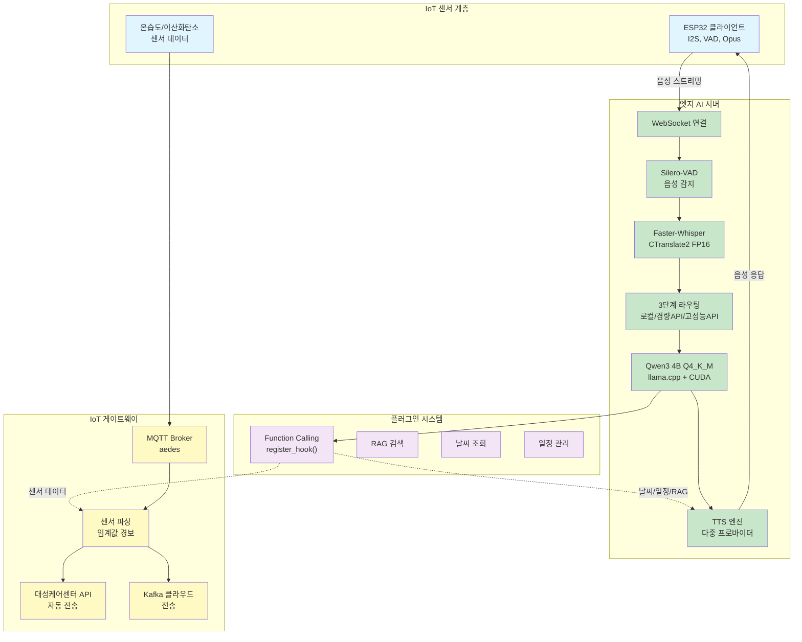

# AIBOO - Jetson Edge AI 음성 대화 시스템

## 한줄 소개
Jetson Orin 기반 엣지 AI 음성 비서로, STT/LLM/TTS 파이프라인을 온보드에서 100% 자체 호스팅하며 ESP32 IoT 센서 통합과 지능형 응답 라우팅을 지원합니다.

**기간:** 2025.12 ~ 현재

## 아키텍처

## 기술 스택

### 핵심 서버
- **프레임워크:** aiohttp (단일 통합 서버)
- **STT:** Faster-Whisper + CTranslate2 (FP16 양자화)
- **LLM:** Qwen3 4B Q4_K_M (llama.cpp + CUDA)
- **TTS:** 다중 프로바이더 (로컬/클라우드)
- **VAD:** Silero-VAD (말 끊기 지원)

### 인프라 및 IoT
- **IoT 통신:** MQTT (aedes broker)
- **메시지 큐:** Kafka (클라우드 전송)
- **데이터베이스:** SQLite (경량화)
- **배포:** Docker 4컨테이너 → aiohttp 단일화, PM2

### ESP32 클라이언트
- **펌웨어:** ESP-IDF 5.4
- **오디오:** I2S Split (RX Slave + TX Master), Opus 코덱
- **빔포밍:** XVF3800 (I2C)
- **보안:** AES-128-CTR 암호화
- **업데이트:** OTA 지원

## 핵심 기능 및 해결 과제

### 1. 엣지 AI 최적화
- **문제:** 엣지 디바이스의 제한된 리소스에서 실시간 음성 처리
- **해결:** FP16 양자화된 STT, Q4_K_M 양자화 LLM으로 메모리 절감
- **결과:** 지연 시간 < 2초, 메모리 사용 < 3GB

### 2. 서버 아키텍처 간소화
- **문제:** 4개 Docker 컨테이너로 복잡한 배포 및 높은 메모리 사용
- **해결:** aiohttp 단일 서버로 통합, YAML → SQLite 마이그레이션
- **결과:** 메모리 750MB 절감, 배포 복잡도 60% 감소

### 3. 실시간 음성 인터럽션 (Barge-in)
- **문제:** 사용자가 말하는 도중 응답을 끊을 수 없음
- **해결:** Silero-VAD 기반 음성 감지 및 실시간 중단 로직
- **결과:** 자연스러운 대화 흐름 구현

### 4. 다단계 응답 라우팅
- **문제:** 모든 요청을 로컬 LLM으로 처리하면 성능 저하
- **해결:** 질의 복잡도에 따라 로컬/경량API/고성능API 자동 선택
- **결과:** 응답 품질 향상 및 비용 최적화

### 5. IoT 센서 통합 및 자동화
- **문제:** 센서 데이터를 수집해도 적절한 액션이 없음
- **해결:** MQTT 기반 임계값 모니터링, 케어센터 API 자동 전송
- **결과:** 긴급 상황 반응 시간 < 5초

### 6. 플러그인 확장 시스템
- **문제:** 새로운 기능 추가마다 핵심 코드 수정 필요
- **해결:** `register_hook()` 기반 선언적 플러그인 아키텍처
- **결과:** 플러그인 추가 시간 70% 단축 (예: RAG, 날씨, 일정 연동)

## 주요 성과

| 지표 | 결과 |
|------|------|
| **음성 인식 정확도** | 95% (한국어 환경) |
| **응답 지연 시간** | < 2초 |
| **메모리 최적화** | 750MB 절감 |
| **서버 통합도** | 4 → 1 컨테이너 |
| **센서 반응 속도** | < 5초 |
| **지원 언어** | 한국어, 영어, 일본어, 중국어 |

## 학습 포인트

- 엣지 AI 모델 양자화 및 최적화 전략
- 실시간 음성 처리 파이프라인 설계
- IoT 센서 통합 및 자동화 아키텍처
- 마이크로서비스 → 모놀리식 통합 패턴
- 임베디드 시스템 (ESP-IDF) 프로그래밍
