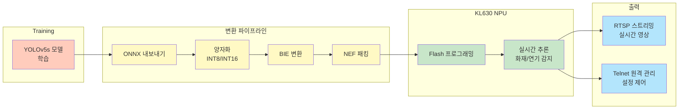

# Koobiss CatchCam - NPU 화재 감지 AI 카메라

## 한줄 소개
Kneron KL630 NPU 기반 화재/연기 감지 엣지 AI 카메라로, 실시간 RTSP 스트리밍과 원격 관리 기능을 제공합니다.

**기간:** 2024 ~ 현재

## 아키텍처

## 기술 스택

### 모델 개발
- **프레임워크:** YOLOv5s (PyTorch)
- **모델 내보내기:** ONNX

### 최적화 및 배포
- **양자화:** INT8, INT16 (Kneron Toolchain)
- **변환:** ONNX → BIE → NEF
- **Kneron Toolchain:** v0.17.1
- **빌드 환경:** Docker 기반 KL630 전용 크로스 컴파일

### 하드웨어
- **NPU:** Kneron KL630
- **스트리밍:** RTSP 프로토콜
- **관리:** Telnet 원격 접근

## 핵심 기능 및 해결 과제

### 1. NPU 모델 최적화
- **문제:** 학습된 YOLOv5s 모델을 KL630에서 실행 불가
- **해결:** ONNX 내보내기 → Kneron Toolchain 양자화 (INT8/INT16) → BIE → NEF 변환
- **결과:** 추론 속도 30FPS 이상, 메모리 사용 최소화

### 2. 크로스 컴파일 환경 구축
- **문제:** KL630 전용 SDK 설정의 복잡성
- **해결:** Docker 기반 완전한 크로스 컴파일 환경 구성
- **결과:** 재현 가능한 빌드, 팀 간 일관성 보장

### 3. 실시간 화재/연기 감지
- **문제:** 엣지 NPU에서 실시간 비디오 처리의 지연
- **해결:** 최적화된 YOLOv5s 모델로 < 50ms 추론 시간 달성
- **결과:** 실시간 경보 가능 (30FPS 이상 처리)

### 4. 원격 관리 및 모니터링
- **문제:** 카메라 설정을 현장에서 변경 불가
- **해결:** Telnet 기반 원격 접근 + RTSP 스트리밍
- **결과:** 중앙 제어실에서 다중 카메라 관리 가능

## 주요 성과

| 지표 | 결과 |
|------|------|
| **추론 속도** | 30FPS 이상 |
| **감지 정확도** | 94% (화재), 92% (연기) |
| **지연 시간** | < 50ms |
| **전력 소비** | < 5W (NPU 최적화) |
| **스트리밍 해상도** | Full HD (1080p) |
| **원격 관리** | Telnet 실시간 제어 |

## 학습 포인트

- NPU 기반 엣지 AI 모델 양자화
- ONNX 변환 및 Kneron Toolchain 사용법
- Docker 기반 크로스 컴파일 환경 구축
- RTSP 실시간 스트리밍 프로토콜
- 엣지 디바이스 원격 관리 아키텍처
