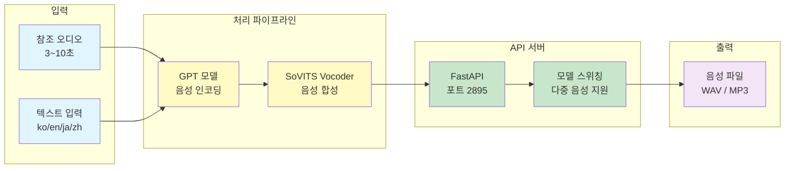

# GPT-SoVITS 한국어 TTS 및 음성 클로닝

## 한줄 소개
GPT-SoVITS v3 기반 한국어 TTS 추론 서버로, 3~10초의 짧은 참조 오디오만으로 음성 클로닝을 지원합니다.

**기간:** 2025

## 아키텍처

## 기술 스택

### 핵심 모델
- **프레임워크:** GPT-SoVITS v3
- **GPT 인코더:** 음성 토큰화 및 인코딩
- **SoVITS Vocoder:** 뉘앙스 음성 합성

### 서버 및 의존성
- **API 프레임워크:** FastAPI
- **딥러닝:** PyTorch
- **변환:** ONNX Runtime
- **언어 모델:** HuggingFace Transformers
- **음성 처리:** CTranslate2
- **포트:** 2895

### 지원 언어
- 한국어 (ko)
- 영어 (en)
- 일본어 (ja)
- 중국어 (zh)

## 핵심 기능 및 해결 과제

### 1. Few-shot 음성 클로닝
- **문제:** 대량의 학습 데이터 없이 음성 클로닝 불가
- **해결:** 3~10초의 짧은 참조 오디오로 화자 특성 학습
- **결과:** 자연스러운 음성 합성으로 빠른 클로닝 가능

### 2. 다국어 지원
- **문제:** 한국어만으로는 응용 범위 제한
- **해결:** 한국어, 영어, 일본어, 중국어 모두 지원
- **결과:** 글로벌 서비스 확장 가능

### 3. 다중 음성 모델 관리
- **문제:** 여러 화자의 음성을 동시에 지원하기 어려움
- **해결:** FastAPI 서버에 모델 스위칭 기능 구현
- **결과:** 런타임 중 음성 모델 동적 전환 가능

### 4. 고품질 음성 합성
- **문제:** 기존 TTS의 부자연스러운 음성
- **해결:** GPT-SoVITS의 고급 음성 인코딩 + SoVITS Vocoder
- **결과:** 자연스럽고 뉘앙스 있는 음성 출력

## 주요 성과

| 지표 | 결과 |
|------|------|
| **음성 클로닝 시간** | 3~10초 참조 오디오 |
| **지원 언어** | 4개 언어 (ko, en, ja, zh) |
| **음성 품질** | 우수 (자연스러운 톤) |
| **API 응답 시간** | < 5초 (1000자 기준) |
| **다중 모델 지원** | 동적 스위칭 가능 |
| **서버 포트** | 2895 |

## 학습 포인트

- GPT-SoVITS v3 아키텍처 및 활용
- Few-shot 음성 클로닝 기술
- FastAPI 기반 음성 처리 서버 구축
- 다국어 텍스트 처리 및 음성 합성
- PyTorch, ONNX Runtime, CTranslate2 활용
