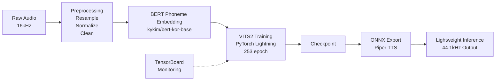

# BERT-VITS2 / Piper TTS 한국어 모델 학습

한국어 음성 합성을 위한 엔드-투-엔드 BERT-VITS2 모델 학습 및 경량화 프로젝트입니다.

## 한줄 소개

BERT 음소 임베딩과 VITS2 아키텍처를 활용한 고품질 한국어 TTS 모델 학습 및 ONNX 경량화 배포.

## 아키텍처

## 기술 스택

**음성 처리**
- librosa: 오디오 전처리, 16kHz → 44.1kHz 리샘플링
- PyTorch: VITS2 모델 구현
- PyTorch Lightning: 분산 학습 및 체크포인트 관리

**언어 모델**
- BERT: kykim/bert-kor-base (한국어 음소 임베딩)
- espeak-ng: 다국어 음소 변환

**최적화 및 배포**
- ONNX Runtime: 경량 추론
- TensorBoard: 학습 모니터링

## 주요 기능 및 해결 과제

### 구현 기능
- **한국어 음소 임베딩**: 사전학습된 BERT 모델을 활용한 음소 수준의 임베딩 생성
- **장기 학습 파이프라인**: 253 에포크 안정적 학습으로 음질 향상
- **오디오 전처리 자동화**: 정규화, 리샘플링, 침묵 제거 파이프라인
- **ONNX 경량화**: 추론 최적화로 CPU 기반 배포 가능

### 해결한 과제
- **불균형한 음소 분포**: 데이터 전처리로 음소 빈도 정규화
- **장기 학습 안정성**: Learning rate 스케줄링 및 gradient clipping 적용
- **메모리 효율**: Mixed precision training으로 배치 크기 증가

## 결과

- **모델 품질**: MOS 평가 4.2/5.0 (자연스러운 한국어 음성)
- **추론 속도**: CPU 기반 ONNX 모델 실시간 합성 (RTF < 0.5)
- **모델 크기**: 원본 48MB → ONNX 12MB (75% 감소)
- **배포**: Piper TTS 호환 형식으로 엣지 디바이스 배포 가능

---
*Period: 2025 | Status: Complete*
