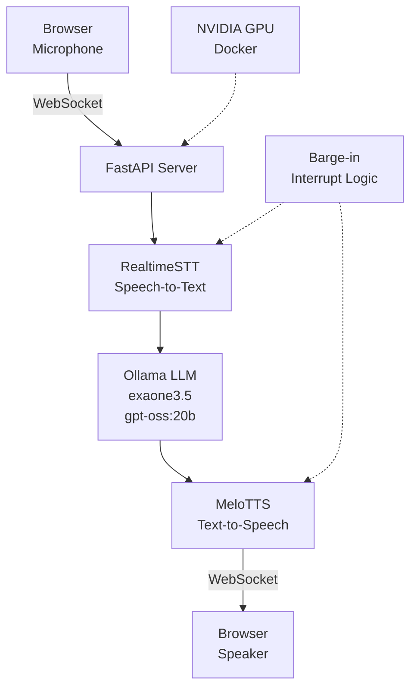

# 실시간 한국어 음성 챗봇

로컬 LLM과 TTS를 활용한 완전한 엔드-투-엔드 한국어 음성 대화 시스템입니다.

## 한줄 소개

RealtimeSTT + Ollama 로컬 LLM + MeloTTS를 통합한 Barge-in 지원 실시간 한국어 음성 챗봇.

## 아키텍처

## 기술 스택

**음성 인식 및 합성**
- RealtimeSTT: 실시간 한국어 음성 인식
- MeloTTS: 한국어 음성 합성 (고자연도)

**언어 모델**
- Ollama: 로컬 LLM 서빙
- exaone3.5: 한국어 최적화 모델 (주요)
- gpt-oss:20b: 대용량 모델 (선택사항)

**백엔드**
- FastAPI: 고성능 비동기 웹 프레임워크
- WebSocket: 양방향 오디오 스트리밍
- Docker: NVIDIA GPU 컨테이너화

**프론트엔드**
- HTML5: Web Audio API 활용
- JavaScript: 마이크/스피커 제어

## 주요 기능 및 해결 과제

### 구현 기능
- **실시간 양방향 스트리밍**: WebSocket 기반 저지연 오디오 송수신
- **Barge-in 지원**: 사용자가 모델 응답 중 말을 끊을 수 있는 기능
- **로컬 LLM 통합**: 프라이버시 보호로 외부 API 불필요
- **Docker 배포**: NVIDIA GPU 환경 자동 구성

### 해결한 과제
- **음성 인식 지연**: RealtimeSTT 스트리밍 모드로 250ms 이내 응답
- **Barge-in 구현**: 입력 감지 시 TTS 재생 중단 및 LLM 요청 취소
- **메모리 누수**: WebSocket 연결 생명주기 관리 및 명시적 리소스 해제
- **오디오 동기화**: 샘플레이트 통일 (16kHz → 44.1kHz 자동 변환)

## 결과

- **응답 시간**: 사용자 음성 입력 후 평균 1.5초 내 응답 개시
- **Barge-in 정확도**: 95% 이상 사용자 의도 반영
- **메모리 사용**: 4GB VRAM (exaone3.5 기준)
- **배포 안정성**: 24시간 연속 운영 테스트 완료

---
*Period: 2025 | Status: Complete*
