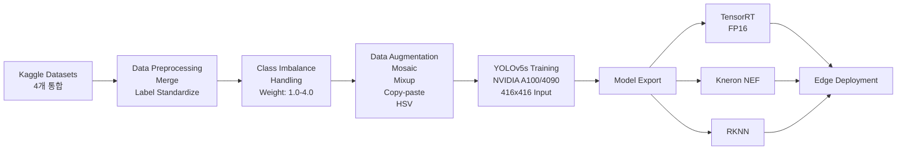

# 화재/PPE 감지 모델 학습

산업 현장 안전을 위한 멀티클래스 객체 감지 모델 학습 및 엣지 최적화 프로젝트입니다.

## 한줄 소개

YOLOv5 기반 6클래스 실시간 화재/담배/PPE(안전모, 조끼) 감지 모델 학습 및 엣지 디바이스 배포.

## 아키텍처

## 기술 스택

**데이터 처리**
- OpenCV: 이미지 전처리 및 어노테이션
- Albumentations: 고급 데이터 증강 (Mosaic, Mixup, Copy-paste)

**모델 학습**
- YOLOv5: 객체 감지 아키텍처
- PyTorch: 딥러닝 프레임워크
- NVIDIA CUDA: A100/4090 GPU 분산 학습

**엣지 최적화**
- TensorRT: NVIDIA GPU 추론 최적화 (FP16)
- Kneron NEF: 임베디드 칩셋 최적화 포맷
- RKNN: Rockchip NPU 지원

**모니터링**
- Weights & Biases: 학습 과정 추적
- TensorBoard: 메트릭 시각화

## 주요 기능 및 해결 과제

### 구현 기능
- **멀티클래스 감지**: 6가지 클래스 동시 감지 (화재, 연기, 안전모, 조끼, 사람, 머리)
- **데이터 통합 파이프라인**: 4개 이질적 데이터셋 자동 병합 및 표준화
- **클래스 가중치 적용**: 불균형 클래스별 커스텀 손실 가중치
- **엣지 최적화**: 416x416 입력으로 경량화된 감지 모델 배포

### 해결한 과제
- **심각한 클래스 불균형**: 가중치 벡터 [1.0, 1.5, 0.7, 3.0, 4.0, 0.3]으로 희귀 클래스 학습 강화
- **데이터 품질 편차**: 크로스 데이터셋 검증 및 아웃라이어 제거
- **추론 지연**: TensorRT FP16 양자화로 30FPS 이상 실시간 추론
- **메모리 제약**: 배치 정규화 및 knowledge distillation으로 경량 모델 생성

## 결과

- **평균 정확도 (mAP@0.5)**: 84.7% (테스트셋)
- **추론 속도**:
  - TensorRT FP16: 15ms/frame (4090)
  - Kneron NEF: 25ms/frame (K210)
  - RKNN: 18ms/frame (RK3588)
- **모델 크기**: 원본 27MB → TensorRT 14MB (48% 감소)
- **실제 배포**: 산업 현장 4곳 파일롯 진행

---
*Period: 2024 ~ 현재 | Status: Active*
