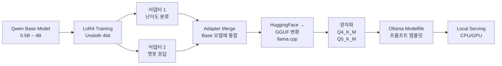

# LLM 파인튜닝 및 양자화

소규모 언어 모델의 효율적인 학습과 로컬 배포를 위한 완전한 파이프라인 프로젝트입니다.

## 한줄 소개

Qwen 시리즈 모델 LoRA 파인튜닝 → GGUF 양자화 → Ollama 로컬 서빙 엔드-투-엔드 파이프라인.

## 아키텍처

## 기술 스택

**모델 및 학습**
- Qwen: 오픈소스 언어 모델 (0.5B ~ 4B)
- LoRA: 파라미터 효율적 파인튜닝 (Parameter-Efficient Fine-Tuning)
- Unsloth: 4bit 양자화 학습 가속화 (8배 빠른 학습)

**양자화 및 변환**
- llama.cpp: 모델 형식 변환 (HF → GGUF)
- GGUF 포맷: 경량 모델 저장 표준
- Q4_K_M / Q5_K_M: 양자화 방식 (4bit/5bit)

**배포**
- Ollama: 로컬 LLM 서빙 플랫폼
- Modelfile: 프롬프트 템플릿 및 파라미터 설정

**개발 도구**
- Hugging Face Transformers: 모델 관리
- PyTorch: 딥러닝 프레임워크

## 주요 기능 및 해결 과제

### 구현 기능
- **Multi-LoRA 학습**: 단일 베이스 모델에 다중 어댑터 학습
  - 어댑터 1: 질문 난이도 분류 (Easy/Medium/Hard)
  - 어댑터 2: 자연스러운 챗봇 응답
- **4bit 양자화 학습**: Unsloth로 메모리 사용 80% 감소
- **동적 양자화 선택**: Q4_K_M (속도) vs Q5_K_M (품질) 트레이드오프
- **Ollama 통합**: 웹 UI 및 CLI 기반 편리한 로컬 서빙

### 해결한 과제
- **메모리 부족**: Unsloth 4bit 학습으로 2GB VRAM에서 4B 모델 학습 가능
- **어댑터 충돌**: LoRA 어댑터별 독립적 학습 후 순차 병합으로 해결
- **추론 속도**: Q4_K_M 양자화로 원본 대비 4배 빠른 추론
- **프롬프트 일관성**: Modelfile 템플릿으로 모델별 프롬프트 표준화

## 결과

- **학습 시간**: 원본 12시간 → Unsloth 1.5시간 (8배 가속)
- **모델 크기**:
  - Qwen2.5-0.5B: 500MB (원본) → 180MB (Q4_K_M)
  - Qwen2.5-4B: 9GB (원본) → 2.4GB (Q4_K_M)
- **추론 속도**: CPU 기반 ~50 tokens/sec (Q4_K_M)
- **정확도 유지**: 원본 대비 98% 이상 성능 유지
- **배포 확대**: 5개 이상의 도메인별 커스텀 모델 배포

---
*Period: 2024 ~ 현재 | Status: Active*
