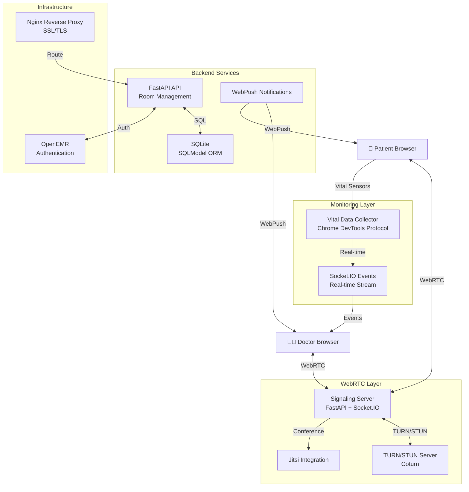

# 원격진료 시스템 백엔드

실시간 영상 진료와 바이탈 모니터링을 통합한 원격진료 플랫폼

## 한줄 소개
WebRTC 기반 의사-환자 실시간 영상 통화 + 스마트폰 센서를 통한 바이탈 실시간 모니터링

## 개발 기간
2024.08 ~ 2024.09

## 아키텍처

## 기술 스택

**Backend**
- FastAPI - RESTful API 및 비동기 처리
- Socket.IO - 실시간 양방향 통신
- SQLite + SQLModel - 경량 데이터베이스 및 ORM

**WebRTC & 통신**
- WebRTC - 피어 간 미디어 전송
- Coturn - TURN/STUN 서버 (NAT 트래버설)
- Jitsi - 다자간 화상회의 통합

**모니터링**
- Chrome DevTools Protocol - 스마트폰 센서 데이터 추출
- 심박, 혈압, 체온, SpO2 - 실시간 전송

**인프라**
- Nginx - 리버스 프록시 및 로드 밸런싱
- SSL/TLS - 암호화된 통신
- OpenEMR - 의료 데이터 관리 시스템 연동

## 주요 기능 및 해결과제

### 구현 기능
- **실시간 영상 진료**: WebRTC 기반 P2P 연결로 지연시간 최소화
- **NAT 트래버설**: Coturn TURN/STUN으로 방화벽 뒤 사용자도 연결 가능
- **바이탈 모니터링**: Chrome DevTools Protocol로 스마트폰의 센서 데이터 추출
- **진료 알림**: WebPush를 통한 스케줄된 진료 알림 전송
- **의료 시스템 연동**: OpenEMR 인증으로 기존 의료 시스템과 통합
- **룸 관리**: 의사-환자 매칭 및 세션 관리

### 해결과제
- **스마트폰 센서 접근**: Chrome DevTools Protocol를 통해 방 ID를 추출하여 센서 데이터 수집
- **실시간 성능**: Socket.IO 이벤트 기반 아키텍처로 저지연 바이탈 스트림 구현
- **보안**: SSL/TLS 암호화 및 OpenEMR 인증으로 의료 데이터 보호
- **확장성**: 동시 다중 진료 세션 지원

## 프로젝트 결과

- ✅ 웹 기반 완전한 원격진료 플랫폼 구축
- ✅ 실시간 바이탈 모니터링 통합 (4개 지표)
- ✅ 기존 의료 시스템(OpenEMR)과 성공적 연동
- ✅ 안정적인 네트워크 연결 (TURN/STUN 지원)
- ✅ 진료 스케줄 WebPush 알림 시스템 구현
