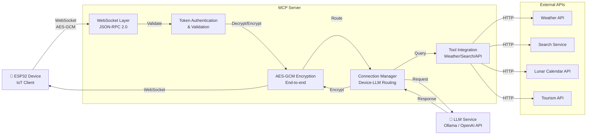

# MCP 엔드포인트 서버

ESP32 디바이스와 LLM 서비스 간 통신을 중계하는 보안 강화 JSON-RPC 서버

## 한줄 소개
WebSocket 기반 JSON-RPC 중계 서버로 임베디드 디바이스와 LLM 서비스를 안전하게 연결

## 개발 기간
2026.03 ~ 현재

## 아키텍처

## 기술 스택

**Backend**
- FastAPI - 비동기 웹 프레임워크
- WebSocket - 양방향 실시간 통신
- Python 3.9+ - 핵심 개발 언어

**보안**
- AES-GCM 대칭 암호화 - 엔드투엔드 보안 (ECB → GCM으로 진화)
- 토큰 기반 인증 - 디바이스별 고유 인증
- 화이트리스트 검증 - RCE 공격 차단

**도구 연동**
- 날씨 API - 실시간 기상 정보
- 검색 API - 정보 검색 도구
- 음력 API - 전통 달력 데이터
- 관광 API - 여행 정보 서비스

**통신 프로토콜**
- JSON-RPC 2.0 - 표준화된 메서드 호출
- WebSocket - 저지연 양방향 채널

## 주요 기능 및 해결과제

### 구현 기능
- **보안 암호화 통신**: AES-GCM 256-bit 대칭 암호화로 엔드투엔드 보호
- **토큰 인증**: 각 ESP32 디바이스별 고유 토큰 기반 인증
- **스마트 라우팅**: 다중 디바이스와 LLM 서비스 간 자동 연결 관리
- **도구 통합**: 4가지 외부 API 서비스 통합 (날씨, 검색, 음력, 관광)
- **JSON-RPC 표준화**: 표준 RPC 프로토콜로 상호운용성 보장

### 해결과제
- **보안 강화**: AES-ECB의 보안 취약점을 AES-GCM으로 개선
- **RCE 차단**: eval() 함수 제거 및 화이트리스트 기반 도구 검증으로 원격 코드 실행 공격 방지
- **실시간 성능**: WebSocket 양방향 채널로 지연시간 최소화 (폴링 제거)
- **다중 디바이스 지원**: Connection Manager로 동시 다중 디바이스 연결 관리
- **API 통합**: 다양한 외부 서비스를 통일된 인터페이스로 제공

## 프로젝트 결과

- ✅ 엔드투엔드 암호화된 안전한 통신 채널 구축
- ✅ 토큰 기반 인증 시스템 구현
- ✅ RCE 취약점 완전 제거 (eval() → 화이트리스트)
- ✅ 4개 외부 도구 통합 및 LLM과 연동
- ✅ 다중 ESP32 디바이스 동시 지원 가능
- ✅ JSON-RPC 2.0 표준 준수로 확장성 확보
