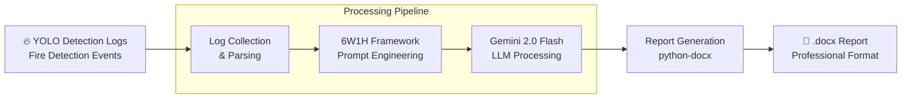

# LLM Report Maker

YOLO 화재 감지 로그를 자동으로 전문적인 보고서로 생성하는 도구

## 한줄 소개
YOLO 화재 감지 로그를 Gemini 2.0 Flash의 6W1H 프레임워크로 처리하여 자동 보고서 생성

## 개발 기간
2025

## 아키텍처

## 기술 스택

**AI & LLM**
- Gemini 2.0 Flash - 고속 텍스트 생성 모델

**데이터 처리**
- Python - 핵심 개발 언어
- JSON/CSV - 로그 포맷

**문서 생성**
- python-docx - Word 문서 프로그래밍
- .docx 포맷 - 전문적인 보고서 형식

## 주요 기능 및 해결과제

### 구현 기능
- **로그 수집**: YOLO 화재 감지 이벤트 자동 수집 및 파싱
- **지능형 분석**: 6W1H 프레임워크 (Who, What, When, Where, Why, How, How much)를 활용한 체계적 분석
- **LLM 활용**: Gemini 2.0 Flash의 빠른 처리로 실시간 보고서 생성
- **전문 보고서**: python-docx로 포맷된 전문적인 .docx 문서 출력
- **자동화**: 감지에서 보고서까지 전체 파이프라인 자동화

### 해결과제
- **자연스러운 구조화**: 6W1H 프레임워크로 무작위 감지 로그를 체계적인 보고서로 변환
- **신속한 처리**: Gemini 2.0 Flash 모델로 빠른 텍스트 생성으로 실시간 대응 가능
- **포맷팅**: python-docx를 이용한 일관되고 전문적인 문서 형식 유지

## 프로젝트 결과

- ✅ 완전 자동화된 화재 감지 보고서 생성 시스템
- ✅ 6W1H 프레임워크 기반 체계적 분석
- ✅ 전문적인 .docx 문서 포맷 지원
- ✅ Gemini 2.0 Flash로 빠른 처리 속도 달성
- ✅ 수동 보고서 작성 업무 완전 자동화
