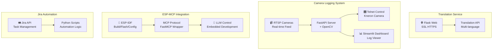

# 기타 서비스 모음

다양한 도메인의 소규모 실무 프로젝트 모음

## 한줄 소개
번역 서비스, 카메라 로그 수집, 임베디드 MCP 통합, Jira 자동화 등 4가지 실용 서비스

## 개발 기간
2024 ~ 2025

## 아키텍처

## 프로젝트별 설명

### 1. 번역 웹 서비스

**기술 스택**
- Flask - 경량 웹 프레임워크
- SSL/TLS - HTTPS 보안 통신
- 다중 언어 API - 자동 번역 지원

**주요 기능**
- 웹 기반 실시간 번역 서비스
- SSL 인증서 적용으로 보안 강화
- RESTful API로 프로그래밍 가능한 인터페이스 제공

---

### 2. 카메라 로그 수집 시스템

**기술 스택**
- FastAPI - 비동기 백엔드 서버
- OpenCV - 컴퓨터 비전 처리
- RTSP 프로토콜 - 실시간 카메라 스트림
- Streamlit - 인터랙티브 대시보드
- Telnet - 네트워크 원격 제어

**주요 기능**
- IP 카메라 RTSP 피드 실시간 수신
- OpenCV로 영상 처리 및 분석
- Telnet을 통한 Kneron 카메라 원격 제어
- Streamlit 기반 실시간 영상 및 로그 대시보드
- 히스토리 저장 및 검색 기능

**해결과제**
- RTSP 멀티 스트림 처리로 동시 다중 카메라 지원
- 실시간 영상과 로그의 동기화
- Telnet 프로토콜로 카메라 제어 명령 자동화

---

### 3. ESP-MCP 프로토콜 통합

**기술 스택**
- ESP-IDF - Espressif 임베디드 프로젝트 관리
- MCP (Model Context Protocol) - 표준화된 서버 프로토콜
- FastMCP - Python 기반 MCP 구현
- Python - 래퍼 및 통합 로직

**주요 기능**
- ESP32 프로젝트 빌드/플래시/타겟 설정을 MCP 도구로 통합
- LLM에서 직접 임베디드 개발 명령어 실행 가능
- CMake, idf.py 등 ESP-IDF 빌드 시스템과의 자동 연동
- 디버깅 및 로깅 정보 자동 수집

**혁신 포인트**
- 기존 CLI 기반 임베디드 개발을 LLM 친화적인 도구로 변환
- AI 어시스턴트가 코드 작성 후 자동으로 컴파일/플래시 가능

---

### 4. Jira API 자동화

**기술 스택**
- Jira REST API - 작업 관리 인터페이스
- Python - 스크립트 언어
- 자동화 엔진 - 반복 작업 자동 처리

**주요 기능**
- Jira 이슈 자동 생성/업데이트/종료
- 프로젝트 상태 모니터링 및 자동 알림
- 반복적인 작업 흐름 자동화
- 레포트 생성 및 대시보드 업데이트 자동화

**효과**
- 수동 작업량 대폭 감소
- 일관된 작업 처리 프로세스 보장
- 팀 생산성 향상

---

## 기술 스택 요약

| 항목 | 기술 |
|------|------|
| **웹 프레임워크** | Flask, FastAPI |
| **보안** | SSL/TLS, Telnet |
| **영상/센서** | OpenCV, RTSP, Streamlit |
| **임베디드** | ESP-IDF, MCP Protocol, FastMCP |
| **자동화** | Python Scripts, Jira API |

## 프로젝트 결과

- ✅ 4가지 실무 중심의 소규모 프로젝트 완성
- ✅ 웹 서비스부터 임베디드 통합까지 다양한 도메인 경험
- ✅ 자동화로 반복 작업 최소화
- ✅ 실시간 모니터링 및 제어 시스템 구축
- ✅ LLM 친화적 도구 설계로 AI 통합 경험 강화
